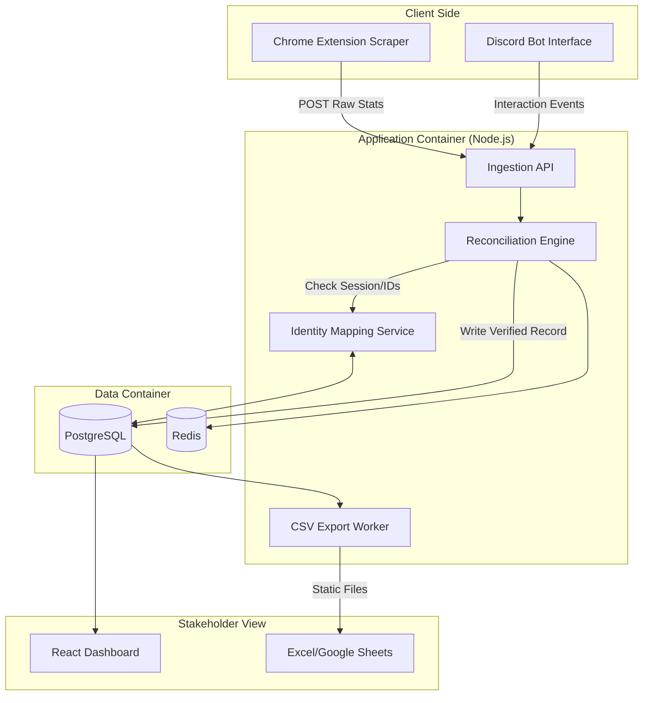

Container A: The Ingress Clients (Edge)

    Scraper Service (Chrome Extension): Built with TypeScript. It monitors the DOM for game-end events. It extracts the Lobby_ID, scores, and captures Session_IDs for guests.

    Discord Bot Service (Discord.js): The interface for manual commands (/log, /stats) and the interactive "Claiming" buttons.

Container B: The Logic Hub (Node.js/TypeScript)

    Ingestion API: A REST endpoint that receives raw payloads. It performs initial validation (schema checks) and dumps data into a "Pending" state.

    Reconciliation Engine: The "brain" of the system. It matches Scraper events with Discord interactions using a time-window algorithm.

    Identity Service: Manages the Identity_Map. It resolves "Guest 123" to "User_UUID" by looking at active sessions and user claims.

Container C: Persistence (Data)

    PostgreSQL (Primary DB): Stores relational data across three schemas: Auth, Raw_Events, and Verified_Ledger.

    Redis (Caching/Locking): Prevents race conditions. If two people click "I won" at the same time, Redis ensures only the first request is processed.

Container D: Presentation & Export

    Admin Dashboard (React): A web interface for you (the Contractor) to manually override conflicts or view system health.

    Export Worker: A scheduled cron job that flattens the relational SQL data into the 3 CSV format and pushes it to an accessible endpoint for the accountant.

1. Event Capture: Data enters the Raw_Events table via the API.

2. Mapping: The IDService attempts to resolve all names. If "Guest" is found, the Discord Bot triggers a "Claim Request."

3. Verification: Once all participants are mapped to Internal_UIDs, the Engine calculates ELO and moves the row to the Verified_Ledger.

4. Reporting: The Export Worker pulls only from Verified_Ledger, ensuring the accountant never sees "dirty" or duplicate data.